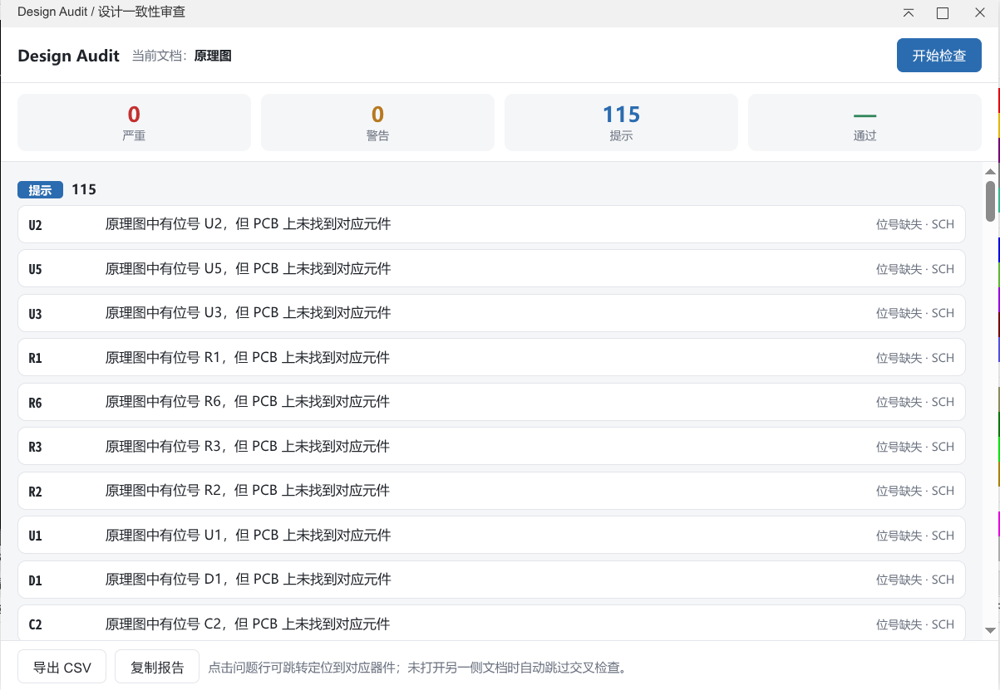

# 设计一致性审查

一款面向嘉立创 EDA 专业版的**设计一致性审查**扩展：一键检查原理图、PCB 与 BOM 的一致性，输出按严重程度分级的问题清单，并支持点击问题行直接跳转定位到对应器件，帮助工程师在交付、评审、打样前快速发现设计隐患。

- 开源协议：Apache-2.0
- 适用版本：嘉立创 EDA 专业版（engines.eda ≥ 3.2.0）
- 源码仓库：https://github.com/kong522/design-audit

## 运行效果



在原理图 / PCB 页面顶部菜单点击 **Design Audit → Run Design Audit...**，即可打开审查面板：点击「开始检查」，分级问题清单按 严重 / 警告 / 提示 分组展示，点击任意问题行自动跳转定位到对应器件。

## 功能

| 检查项 | 严重级别 | 说明 |
|---|---|---|
| 位号重复 | 🔴 严重 | 同一文档内出现重复位号（原理图 / PCB 分别检查） |
| 封装缺失 | 🟡 警告 | 器件未声明 Footprint（原理图 / PCB 分别检查） |
| 器件值缺失 | 🔵 提示 | 器件缺少 Value，BOM 中将显示为空 |
| 封装不一致 | 🔴 严重 | 原理图声明的封装与 PCB 上实际放置的封装不一致 |
| 位号缺失 | 🔵 提示 | 原理图位号在 PCB 中缺失（或反之，可能为机械件/测试点） |

- **点击跳转**：点击任意问题行，自动选中并缩放定位到对应器件
- **结果统计**：面板顶部按 严重 / 警告 / 提示 / 通过 汇总计数
- **报告导出**：一键导出 CSV 报告或复制 JSON 报告，可直接附入评审单
- **全离线运行**：所有检查均在本地完成，无任何网络请求
- **双语界面**：根据系统语言自动切换 简体中文 / English

## 使用方法

1. 在嘉立创 EDA 专业版中打开你的工程（建议同时打开**原理图**和**PCB**，以便执行交叉检查）
2. 点击顶部菜单 **Design Audit → Run Design Audit...**（原理图 / PCB 页面下均有入口）
3. 在弹出的审查面板中点击 **开始检查**
4. 查看问题清单：红色 = 严重，黄色 = 警告，蓝色 = 提示
5. 点击问题行即可跳转定位到对应器件
6. 需要存档时，点击 **导出 CSV** 或 **复制报告**

> 提示：若只打开了原理图或 PCB 单侧文档，交叉检查（封装一致性、位号缺失）将自动跳过，面板会明确提示。

## 开发

```bash
npm install        # 安装依赖
npm run build      # 构建扩展包（输出至 build/dist/*.eext）
npm run lint       # 代码规范检查
npx tsc --noEmit   # 类型检查
```

### 项目结构

```
├── extension.json        # 扩展配置（菜单注册、元信息）
├── src/index.ts          # 入口：打开审查面板 / 关于
├── iframe/audit.html     # 审查面板 UI + 检查器逻辑（内联，直接访问 eda）
└── locales/              # 多语言（zh-Hans / en）
```

### 调试

- 在编辑器 URL 添加 `cll=debug` 进入调试模式，连续按三次 `F12` 打开开发者工具
- 面板内的日志以 `[Design Audit]` 前缀输出到控制台
- 如扩展引发异常无法正常移除，可在 URL 添加 `safetyMode=true` 全局禁用扩展与脚本系统

## 原理

扩展 API 全部运行于客户端本地：`eda.dmt_SelectControl.getCurrentDocumentInfo()` 获取当前文档，`eda.sch_PrimitiveComponent.getAll()` 读取原理图器件（位号/Value/封装），`eda.pcb_PrimitiveComponent.getAll()` 读取 PCB 元件（位号/封装），检查器在面板内完成比对与归一化，点击问题行通过 `doSelectPrimitives()` + `zoomToSelectedPrimitives()` 实现跳转定位。
